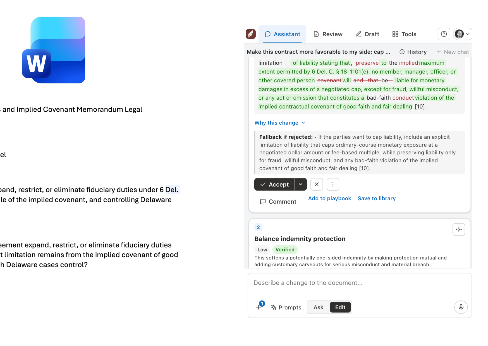
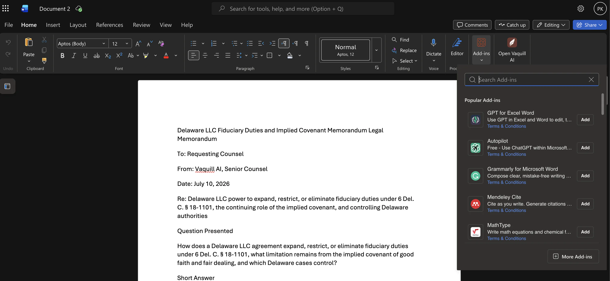
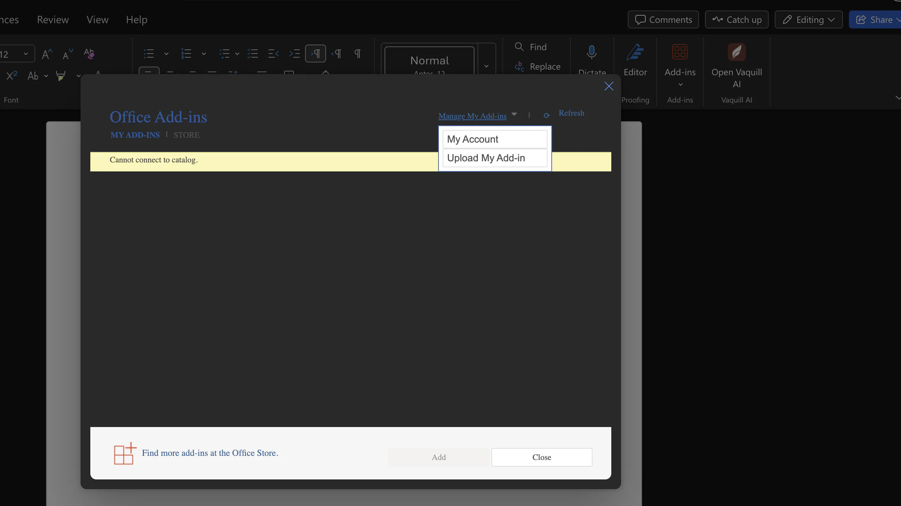
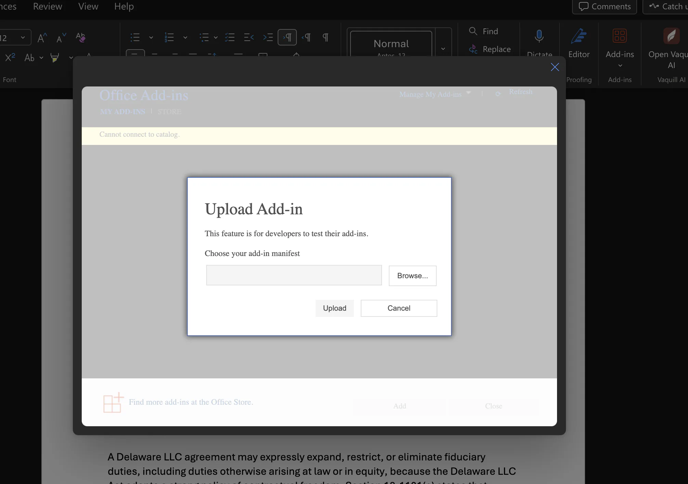
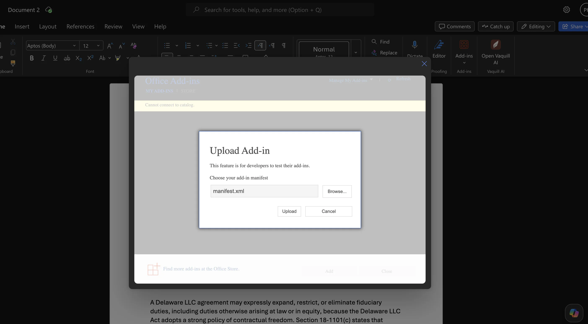
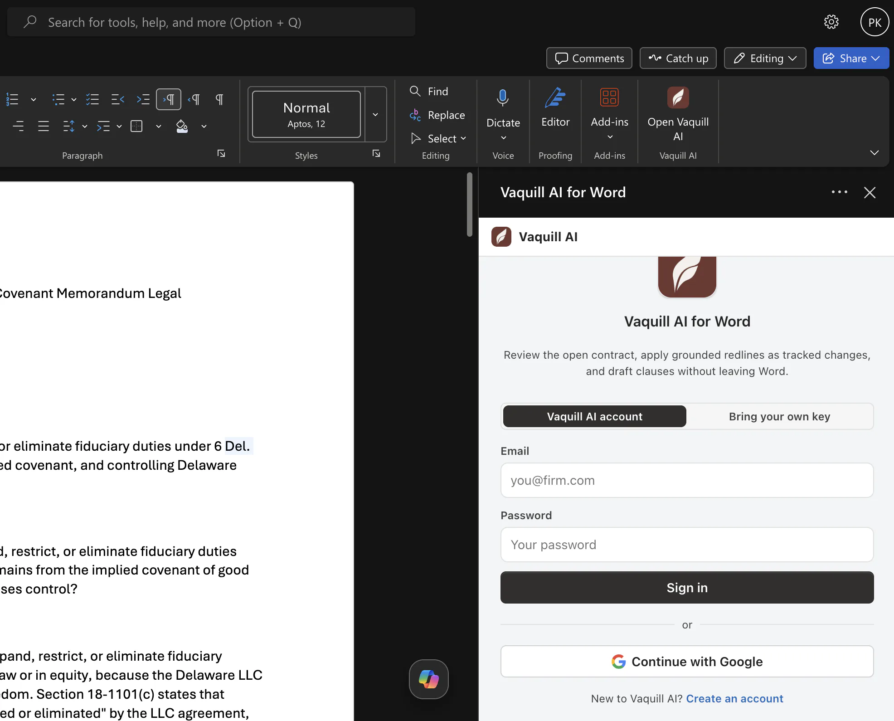
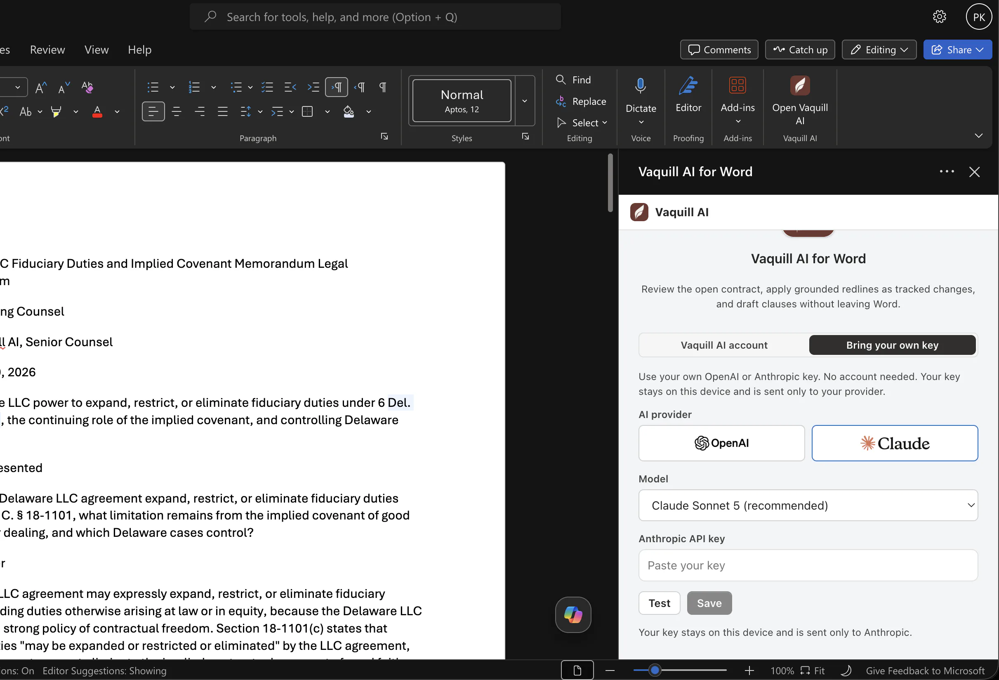

# Vaquill AI for Word



A Microsoft Word add-in (task pane) that brings Vaquill AI contract review, grounded redlining, drafting, and US legal research into Word.

It comes in two builds.
The **hosted** build reads the open document through the Office JavaScript API, calls the Vaquill AI backend for the legal intelligence, and applies the results back into the document as native Word tracked changes, comments, and content controls.
The **community** build runs standalone on your own OpenAI or Anthropic key, with no hosted backend.

Everything operates on the document you already have open in Word.
There is no separate upload step: the open document is the subject.

> **Community edition (bring-your-own-key).**
> A standalone, self-hostable **community build that runs on your own API key (OpenAI or Anthropic)** is available.
> It runs the add-in against your own provider, with no hosted Vaquill AI backend.
> To run it, see [Run it yourself](#run-it-yourself-community-edition) below.
> The default (cloud) build in this repo still targets the hosted backend (see [Backend requirement](#backend-requirement)).

## What works in each edition

| Capability | Vaquill AI (hosted) | Community (your own key) |
| --- | --- | --- |
| Assistant chat over the open document | Yes, grounded in the legal corpus, the web, and your matter files | Yes, grounded in the open document |
| Rewrite, explain, plain-English, risk, compliance, and guideline checks | Yes | Yes |
| Bluebook citation-format check | Yes | Yes |
| Contract review and grounded redlines | Yes | Yes |
| Agentic "draft a stronger fix" | Yes | Yes |
| NDA triage | Yes | Yes |
| Playbook fit and playbook library | Yes | Yes, saved on your device |
| Draft generation | Yes, with corpus and case-law grounding, cited authorities, and a quality score | Yes, without corpus grounding, authorities, or a quality score |
| Clause transplant, fill-from-reference, attach a document | Yes (PDF, DOCX, and more) | Yes (DOCX, TXT, MD) |
| Prompt and clause libraries | Yes, synced to your account | Yes, saved on your device |
| Document tools (Proper Format, defined terms, cross-references, reading navigator, deal cockpit, figures, send-ready, clean copy, tracked-changes review) | Yes | Yes, identical and fully local |
| Case-law existence check (does a cited case exist) | Yes, against the Vaquill AI corpus | Yes, with your own free CourtListener token |
| Good-law / treatment signal (is a case still good law) | Yes | No |
| Statute verification and legal research | Yes | No |
| Authored tracked-changes .docx export | Yes | No |
| Document compare (redline against a reference) | Yes | No |
| Save work to matters, vendors, or the web app | Yes | No |
| AI provider | Managed by Vaquill AI | Your own OpenAI or Anthropic key |
| Where your text is sent | Vaquill AI's backend | Only to the AI provider you choose |
| Hosting | Nothing to run, we host it | You run it, on your machine or your own server |
| Account | Vaquill AI account | No account, just your key |
| Cost | Subscription | You pay your AI provider directly |

## Run it yourself (community edition)

The community edition runs the add-in on your own OpenAI or Anthropic key, with no Vaquill AI backend.
Your documents and prompts go only to the AI provider you choose.
It works on Word for Windows, Word for Mac, and Word on the web.

### Before you start

- Install Node.js from https://nodejs.org (the version labeled "LTS").
- Have Microsoft Word.
- Get an API key from OpenAI (https://platform.openai.com/api-keys) or Anthropic (https://console.anthropic.com/settings/keys). You paste it into the add-in later.

Then download the code:

```bash
git clone https://github.com/Vaquill-AI/vaquill-word-addin.git
cd vaquill-word-addin
npm install
```

### Run it on your own computer

**1. Trust a local certificate (once).** Word only loads add-ins served over HTTPS, even on your own machine:

```bash
npx office-addin-dev-certs install
```

**2. Start the app** and leave the window open. It serves at https://localhost:3000:

```bash
npm run dev:community
```

**3. Load it into Word** by sideloading `manifest.localhost.xml`. Do the part for your version of Word:

- **Word on the web:** open a document, click Add-ins (or Insert, then Add-ins), click "Upload My Add-in", and choose `manifest.localhost.xml`.
- **Word on Mac:** copy `manifest.localhost.xml` into `~/Library/Containers/com.microsoft.Word/Data/Documents/wef` (create the `wef` folder if it is missing), quit and reopen Word, then click Add-ins, My Add-ins, and pick Vaquill AI under Developer Add-ins.
- **Word on Windows:** put `manifest.localhost.xml` in a folder and share the folder with yourself (right-click, Properties, Sharing). In Word go to File, Options, Trust Center, Trust Center Settings, Trusted Add-in Catalogs, add the folder's network path, tick "Show in Menu", reopen Word, and pick Vaquill AI from the Shared Folder tab.

**4. Open it.** In Word, click "Open Vaquill AI". The first time, choose OpenAI or Anthropic, paste your key, click Test, then Save. Your key stays on your device and is sent only to that provider.

#### Walkthrough (Word on the web)

These screenshots show the sideload on Word for the web. The Mac and Windows steps differ only in how you point Word at the manifest.

Open the Add-ins menu (Insert, then Add-ins):



Click "Upload My Add-in":



Browse to your manifest file in the upload dialog:



Choose `manifest.localhost.xml`:



Open Vaquill AI from the ribbon:



Choose OpenAI or Anthropic and paste your own key:



### Run it on a server for your firm

Use this when a team should have it without anyone keeping a terminal open.

1. Build it with `npm run build:community`. This creates a `dist` folder, which is the whole app as plain files.
2. Serve the contents of `dist` over HTTPS on an address you control, for example `https://vaquill.yourfirm.com`. Any static hosting works, and HTTPS is required.
3. Copy `manifest.community.xml`, replace every `YOUR-DOMAIN.example.com` with your address, and replace the `<Id>` line with a new unique id (create one at https://guidgenerator.com).
4. Give that manifest to each person to sideload with the steps above. Each person adds their own key.

### What it can do, and what needs a Vaquill AI account

The comparison table above lists this in full.
In short, these work with just your key: the assistant, drafting, contract review and redlines, playbooks, NDA triage, the prompt and clause libraries, and all the document tools.
These need a Vaquill AI account: statute verification, good-law treatment, document compare, authored tracked-changes export, and saving to the hosted product.
Case-law existence checking works if you add your own free CourtListener token in Settings (get one at https://www.courtlistener.com/help/api/rest/).

### Updating and troubleshooting

To update, run `git pull` then `npm install`, and start it again (or rebuild `dist` for a server).

- Pane is blank or will not load: make sure `npm run dev:community` is still running, and that you ran `npx office-addin-dev-certs install`.
- Word will not load the add-in: close Word completely and reopen it after sideloading.
- A feature says it needs a Vaquill AI account: that feature uses Vaquill AI's hosted data and is not in the community edition.
- Attaching a PDF does not work: this edition reads `.docx`, `.txt`, and `.md`; save a PDF as `.docx` first.

---

## Features

The task pane has four tabs.
The **Assistant** is the default landing tab and the most flexible entry point; the others are structured, single-purpose workflows.

### Assistant

A grounded chat and redline surface over the open contract, with two modes in one composer.

**Ask** answers questions about the open document, grounded in the document itself and (optionally) the US legal corpus and your matter's files.

- Every answer carries checkable **sources**: a numbered list where citation `[N]` maps to source N, with links out where the backend provides them.
- Inline citations are **hoverable and clickable** (hover shows the source; click scrolls to it).
- **Multi-turn memory**: follow-ups are understood in the context of the conversation.
- **Add context** menu: choose what the answer draws on (US case law and statutes, your matter's documents, and web search as an off-by-default opt-in).
- **Attach files** as extra context, with opt-in OCR for scanned PDFs.
- A **prompt library**, an AI **Improve** for your prompt, and a **focus control** to answer about the whole document or just your selection.
- **Copy** (formatted paste into Word, clean text elsewhere) and **Insert into document** (as a tracked change) on every answer.
- Device-local **history** of past chats.

**Edit** turns a plain-English instruction into grounded redlines across the whole document.

- Each edit quotes verbatim current language, so it anchors to real text and applies as a tracked change you accept or reject.
- The set is **agentic**: a dynamic overview explains what it understood and did, each card carries a rationale and a fallback position, and a closing summary says what to check.
- It is **conversational**: a follow-up refines the current set ("make those stronger", "drop #2", "also cap liability") instead of starting over, and your accept/reject decisions carry across refinements.
- Edits are gated against your doc-type playbook for approval level (manager / partner / GC) and deal-breaker flags, and against an anti-hallucination grounding check.

**Selection tools** act on highlighted text: rewrite, explain, plain-English, risk assessment, and compliance check.

The Assistant can also route a chat message into a document action (redline, navigate to a clause, add a comment, accept all changes, make a clean copy), always behind an explicit confirm.

### Review

Turn the open contract into a structured set of grounded redlines.

- Contract type and your side are auto-detected (and adjustable), then the review runs against your playbook.
- Redlines show **severity**, an **inline diff** (with a Redline / Final toggle), the **why**, and a **fallback if rejected**.
- A server-computed **sign-off gate** (manager / partner / GC) and **deal-breaker** flags tell you what needs approval before sending.
- Apply changes as native tracked changes, or export a corrected `.docx` with tracked changes and comments baked in.
- Per-clause **"draft a stronger fix"** runs an agentic diagnose to draft to validate to critique loop.
- Sub-tabs: **Redlines**, **Changes** (triage the counterparty's tracked changes and comments with per-author bulk accept/reject), **Compare** (two versions, with a hidden-revision detector), **Citations** (verify every case citation against the US case-law corpus), and **Playbooks**.

### Draft

Generate a first-draft agreement from a plain-English brief and insert it as formatted content, template-constrained to reduce hallucination.
Reuse saved templates and drafts.

### Tools

Finalize and QA utilities: clean copy (accept all changes and remove comments), defined-term consistency, cross-reference check, a send-ready check, redaction, and document formatting.

### In the document

Highlight issues, push rationales as native comments, bookmark clauses for durable navigation, tag key fields as content controls, and jump around via a clause outline.

### Cross-links back to the platform

Save a review or draft to a matter, save as a template, add to the vendor registry, push a clause to a playbook, and save an answer as a note.

---

## How to use it

Once the add-in is loaded, it opens on the **Assistant** tab.

- **Ask a question.** Type into the composer and send. You get a grounded answer with numbered sources; click a citation to jump to its source, then Copy or Insert the answer.
- **Make a change.** Switch the composer to **Edit**, describe the change ("cap the confidentiality term at three years and add the standard carve-outs"), and review the redline cards. Accept or reject each; ask a follow-up to refine the set.
- **Review a contract.** Open the **Review** tab, confirm the detected type and side, and run it. Work through the redlines, watch the sign-off gate, then apply in place or download a corrected `.docx`.
- **Draft something new.** Open **Draft**, describe the agreement, and insert it.
- **Finalize.** Use **Tools** to make a clean copy, redact, or run the send-ready check before the document leaves your desk.

---

## Requirements

- A Microsoft 365 account and Word (Windows desktop, Mac desktop, or Word on the web).
- Office.js requirement floor **WordApi 1.6**.
- The **Vaquill AI backend** (not included; see below), for the hosted build only. The community edition removes this: bring your own key, no backend.

## Getting started (development)

Requires Node 20+.

```bash
npm install
cp .env.example .env                 # set VITE_SUPABASE_URL and VITE_SUPABASE_ANON_KEY
npx office-addin-dev-certs install    # trusted HTTPS for localhost
npm run dev                           # serves the task pane on https://localhost:3000
npm run sideload                      # loads manifest.dev.xml into Word and opens it
```

Verify and build:

```bash
npm run type-check                    # tsc, no emit
npm run build                         # outputs dist/ (deploy behind HTTPS)
npm run validate:manifest             # validate the production manifest
```

The change gate for a contribution is a green `npm run type-check` and `npm run build`.

Deployment (Docker plus a hardened nginx with security headers and CSP) is documented in [DEPLOY.md](DEPLOY.md).

## Backend requirement

The hosted add-in requires the Vaquill AI backend.
The only backend change needed to run it is CORS: add the add-in origin (`https://word.vaquill.ai`, plus `https://localhost:3000` for dev) to the backend's allowed origins.
Everything else reuses existing endpoints.

The **community edition** lifts this requirement: bring your own API key, with no hosted dependency. See [Run it yourself](#run-it-yourself-community-edition).

## Architecture

```text
Word (desktop / Mac / web)
  task pane (word.vaquill.ai)  --Office.js-->  the open document
        |
        |  Supabase JWT (Bearer) + SSE
        v
  Vaquill AI backend (api.vaquill.ai)   [required today; BYOK in the community edition]
```

## Tech stack

- Vite + React 18 + TypeScript task pane, served as static HTTPS assets.
- Office.js from the Microsoft CDN, requirement floor WordApi 1.6.
- Add-in-only XML manifest (Windows, Mac, web).
- Supabase auth via the Office Dialog API and PKCE (session held in memory only).
- Word-level tracked-change diff via `office-word-diff` (Apache-2.0); see [NOTICE](NOTICE).

## Project layout

```text
src/
  app/          app shell + tab navigation
  features/     one folder per surface (assistant, review, draft, tools, ...)
  office/       Office.js helpers: search/anchoring, redline apply, comments, ...
  api/          typed backend clients (chat, contract-review, edit, research, ...)
  ui/           shared primitives and design-system components
  lib/          framework-agnostic helpers
```

## Contributing

Issues and pull requests are welcome.

## License

Apache License 2.0.
See [LICENSE](LICENSE) and [NOTICE](NOTICE).
